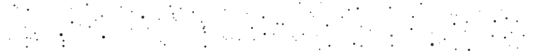

 

# Jarvee

### Web Developer — Vue.js · Next.js · Laravel · AdonisJS

 

 

## 📡 Mission Briefing

Launching interfaces and APIs into orbit — Vue.js and Next.js on the front end, Laravel and AdonisJS powering the engine room, deployed through Vercel. Comfortable navigating the full flight path from design handoff to liftoff.

| | |
|---|---|
| 🛰️ **Version control** | Git · GitHub · Bitbucket |
| 🌌 **Deployment** | Vercel |
| 📶 **Transmission** | [jarveeviosbelarmino@gmail.com](mailto:jarveeviosbelarmino@gmail.com) |

---

## 🎯 Current Orbit

 

 

---

## 🛠️ Tools

<table>
<tr>
<td align="right"><b>Frontend</b></td>
<td></td>
</tr>
<tr>
<td align="right"><b>Backend</b></td>
<td>

</td>
</tr>
<tr>
<td align="right"><b>Version Control</b></td>
<td>

</td>
</tr>
<tr>
<td align="right"><b>Deployment</b></td>
<td></td>
</tr>
</table>

---

## 🌌 Flight Log

  

---

## 🚀 Launch Log

| Mission | Description | Payload | Status |
|---|---|---|:---:|
| [Project Name](https://github.com/DevJarbs/project-name) | One-line description of what it does and the problem it solves. |   | 🟢 |
| [Project Name](https://github.com/DevJarbs/project-name) | One-line description of what it does and the problem it solves. |   | 🟢 |

Pin your best repos directly on your profile for quick access: *Customize your pins → select repos.*

---

### 📡 Ground Control

<!--  -->

  

  

🛰️ Ground control, standing by.

